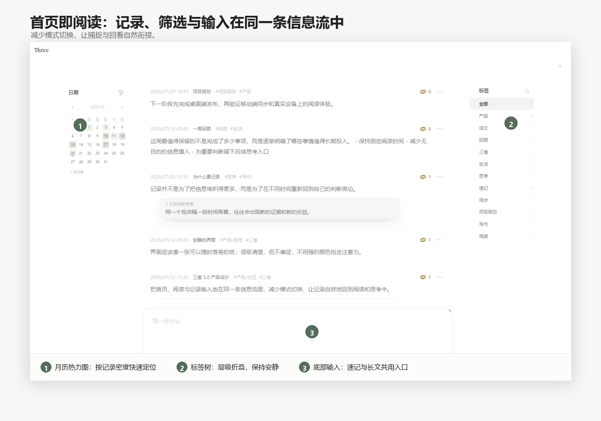
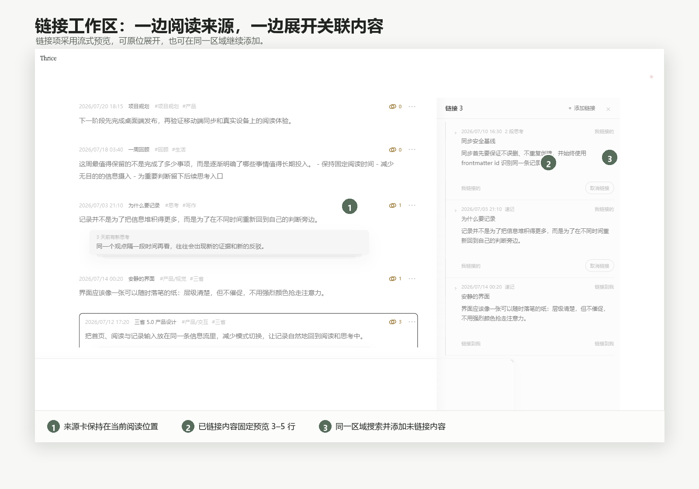
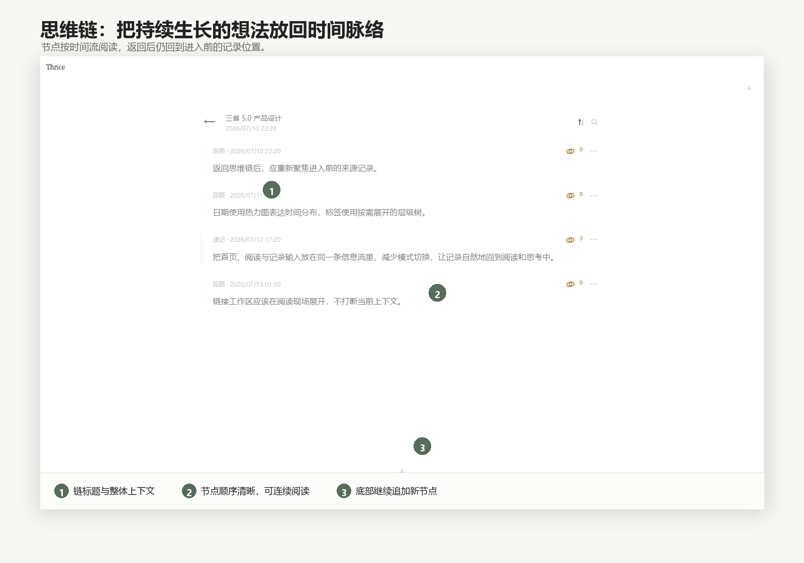
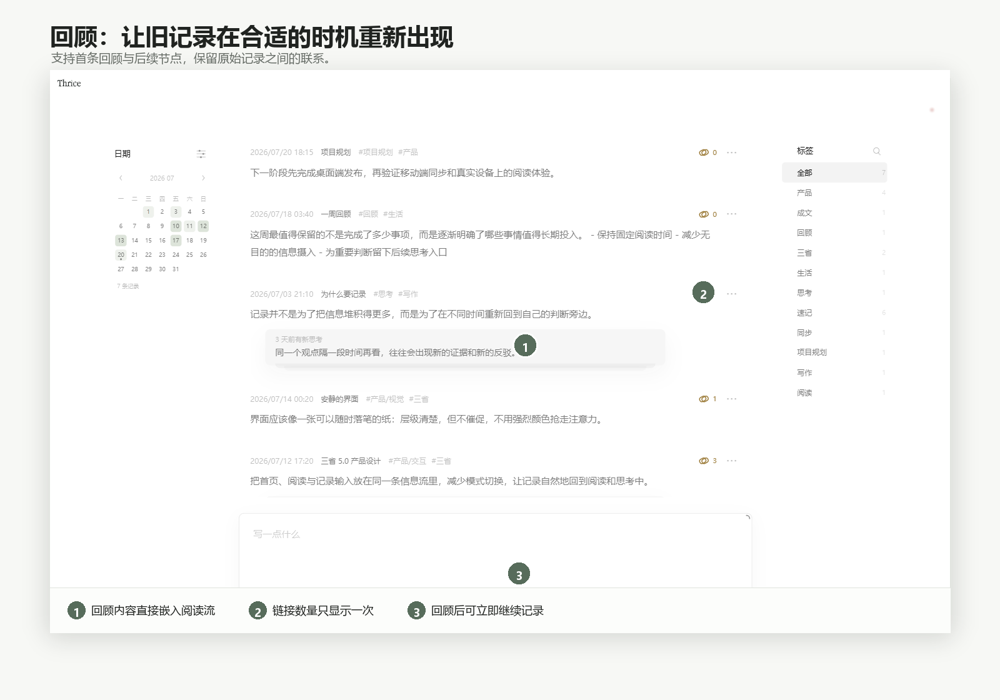
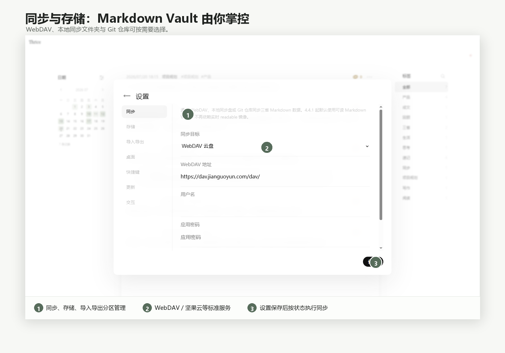

# 三省 Desktop 5.0「脉络」— 公开发布镜像

> 这里提供三省桌面端的公开下载、自动更新元数据和 Release Notes。完整源码与开发说明位于 [`Forunzu/sanxing`](https://github.com/Forunzu/sanxing)。

## 它解决的核心需求，与常见记录工具有何不同

三省更关注一个具体问题：**一条记录写下之后，怎样在未来被重新看见、继续回应，并逐渐形成可阅读的思考脉络。** 下表按各产品公开定位做高层比较，帮助选择更适合自己的工作方式；它不代表完整功能清单，也不构成优劣排名。

| 对比维度 | **三省 Desktop** | [flomo](https://flomoapp.com/) | [Obsidian](https://obsidian.md/) | [Notion](https://www.notion.com/) | [Logseq](https://logseq.com/) |
|---|---|---|---|---|---|
| **核心取向** | 速记、阅读、主动回顾与持续思考形成闭环 | 低门槛卡片记录与日常回顾 | 本地知识库与高度可定制的知识网络 | 文档、数据库、项目与团队协作的一体化工作区 | 日志式大纲、块引用与双向链接知识图谱 |
| **日常输入方式** | 首页阅读流底部直接速记或展开长文 | 像聊天一样快速写下 MEMO | 在本地 Markdown 文件中自由写作 | 在页面、区块和数据库项目中组织内容 | 从 Journal 开始，以块和缩进持续记录 |
| **重新遇见旧内容** | 主动回顾、首条回顾、追加节点、随机漫步与归档节奏 | 每日回顾、标签、搜索与相关笔记 | 通常由搜索、链接、查询、模板或插件组成个人流程 | 通过数据库视图、筛选、提醒和模板重新组织 | 通过 Journal、查询、引用、闪卡等方式回看 |
| **想法如何继续生长** | 回顾节点按时间串成思维链，保留观点变化过程 | 可编辑、批注或继续关联其他 MEMO | 双向链接、嵌入和图谱形成网络 | 页面层级、关系属性与数据库关联 | 块引用、页面引用和链接引用持续展开 |
| **关联内容阅读** | 右侧链接工作区流式预览，可原位展开与继续添加 | 相关笔记与卡片连接 | 链接、反向链接、嵌入与侧栏组合 | 关系、反向链接和页面预览 | 右侧栏、块引用、页面引用与链接引用 |
| **数据形态** | 本地 UTF-8 Markdown Vault；可选 WebDAV、本地同步文件夹或 Git | 云端卡片笔记服务 | 本地 Markdown 文件夹 | 云端工作区中的页面与数据库 | 本地 Markdown / Org 文件图谱 |
| **更适合的核心需求** | 想减少整理负担，又希望旧记录能被持续回应的人 | 想随手记录、跨端同步并养成回顾习惯的人 | 重视本地文件、插件生态和自主搭建流程的人 | 需要结构化管理、项目协同和共享文档的个人或团队 | 偏好大纲、日志和块级引用思考方式的人 |

> 这些工具可以互补。例如，三省更适合作为个人判断与回顾的长期容器；Notion 可继续承担团队项目管理，Obsidian / Logseq 可承担更自由的知识库搭建，flomo 则适合强调跨端快速捕捉的场景。
## 下载

前往 [Latest Release](https://github.com/Forunzu/sanxing-releases/releases/latest)：

| 文件 | 用途 |
|---|---|
| `Sanxing-Desktop-5.0.0-setup.exe` | **推荐**，Windows 一键安装版，支持软件内自动更新 |
| `Sanxing-Desktop-5.0.0-win-x64.zip` | 解压即用的完整绿色版 |
| `Sanxing-Desktop-5.0.0-portable.exe` | 单文件备用版，适合临时或隔离使用 |
| `latest.yml` / `*.blockmap` | 自动更新元数据，请勿单独安装 |
| `SHA256SUMS.txt` | 安装包完整性校验 |

> Windows 安装包当前未进行商业代码签名，SmartScreen 可能在首次下载或启动时提示。请只从 `Forunzu/sanxing` 或本仓库下载，并核验 SHA256。

---

## 5.0「脉络」

三省把 **速记、阅读、回顾、思维链与关联链接** 放进一条连续的信息流，让记录不只被保存，也能在之后继续生长。

### 首页即阅读

- 打开软件即可浏览记录；
- 底部输入区随时速记或展开长文；
- 左侧月历热力图定位日期；
- 右侧层级标签树保持低干扰；
- 默认快捷键 `F8` 呼出速记，`F9` 进入回顾。

### 链接工作区

来源记录保持在左侧，右侧直接流式阅读已链接内容。每项默认预览 3–5 行，可原位展开，也可在顶部搜索并添加未链接的记录或思维链。

### 思维链

围绕同一个主题持续追加节点，保留判断、证据和观点随时间变化的过程。返回列表后会恢复进入前的记录位置。

### 回顾

为旧记录创建第一条回顾或继续追加节点；主动回顾完成后可随机漫步，也可将暂时沉淀的内容归档。

### 数据由你掌控

- 主数据使用 UTF-8 Markdown Vault；
- frontmatter `id` 是每条记录的稳定身份；
- 支持 WebDAV、本地同步文件夹与 Git 仓库；
- 支持软删除与恢复；
- 安装版数据目录：`%APPDATA%\三省\data`。

---

## 自动更新说明

本仓库是三省安装版自动更新的公开源：

- `latest.yml` 描述当前 Windows 安装版本；
- blockmap 用于差分下载；
- 安装包和更新元数据与 [`Forunzu/sanxing`](https://github.com/Forunzu/sanxing) 同版本 Release 保持一致；
- ZIP 和 Portable 用户建议手动下载新版本。

## 数据安全提示

升级或修改同步设置前，建议备份 `%APPDATA%\三省\data` 或导出 Markdown。不要手动删除不理解的 frontmatter 字段；其中的 `id` 用于跨文件名、跨路径和跨设备识别同一条记录。

